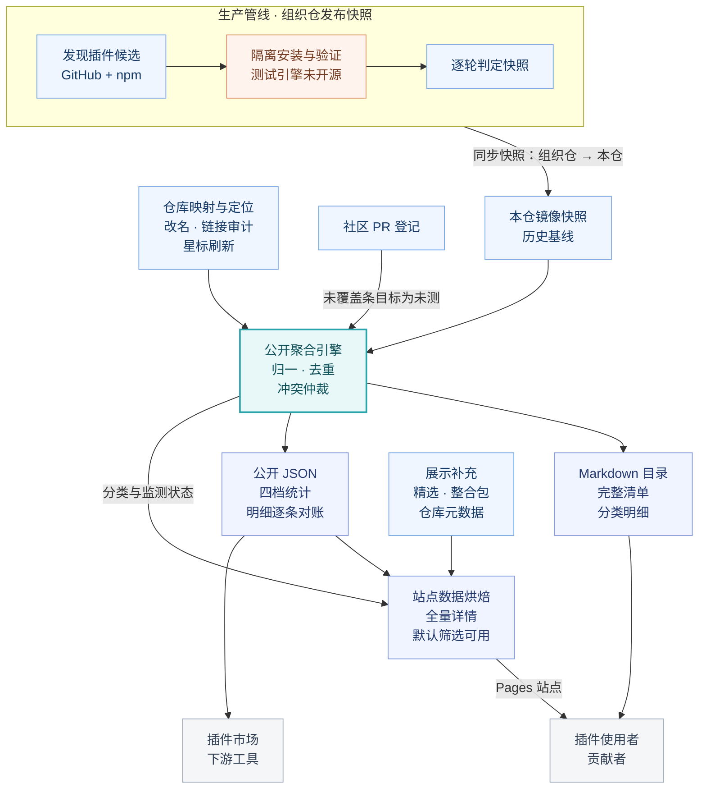

<!-- README:layout:v2 -->

# DSH Plugin Radar

<p align="center">
  
</p>

**发现 DSH 插件，查看兼容性记录，把生态数据接入你的工具。**

*Discover DeepSeek Harness plugins, explore compatibility records, and integrate ecosystem data into your tools.*

DSH Plugin Radar 持续收集插件候选、归并兼容性记录，并发布可浏览的目录与机器可读数据。你可以用它寻找插件，也可以把相同数据接入自己的市场、工具或社区清单。

**[浏览插件](https://adamplatin123.github.io/dsh-plugin-radar/)** · **[接入数据](https://github.com/AdamPlatin123/dsh-plugin-radar/blob/main/docs/api.md)** · **[登记插件](https://github.com/AdamPlatin123/dsh-plugin-radar/blob/main/PLUGINS.md)**

## 选择你的入口

| 你想做什么 | 从哪里开始 |
|---|---|
| 找到合适的插件 | [雷达站点](https://adamplatin123.github.io/dsh-plugin-radar/)提供浏览、筛选、精选与整合包入口 |
| 查看精选与整合包 | [精选与整合包目录](https://github.com/AdamPlatin123/dsh-plugin-radar/blob/main/docs/catalog-highlights.md)，成员由人工策展 |
| 在 GitHub 阅读完整记录 | [完整目录](https://github.com/AdamPlatin123/dsh-plugin-radar/blob/main/PLUGINS-ALL.md)与[分类目录](https://github.com/AdamPlatin123/dsh-plugin-radar/tree/main/catalog/all) |
| 将兼容性记录接入自己的工具 | [数据接口与口径](https://github.com/AdamPlatin123/dsh-plugin-radar/blob/main/docs/api.md) |
| 提交插件或更正记录 | [社区登记表](https://github.com/AdamPlatin123/dsh-plugin-radar/blob/main/PLUGINS.md)与[问题反馈](https://github.com/AdamPlatin123/dsh-plugin-radar/issues) |
| 理解或维护雷达 | [公开引擎](https://github.com/AdamPlatin123/dsh-plugin-radar/tree/main/engine)与[架构说明](https://github.com/AdamPlatin123/dsh-plugin-radar/blob/main/docs/radar/architecture.md) |

## 数据状态

<!-- AUTO:summary:START -->

快照：`20261009T214501Z` · 快照时间：2026-10-10 05:45:04 UTC+8。此摘要由已合并快照对应的聚合结果自动生成。

| 已定位、按仓库去重后的清单 | 条数 |
|---|---:|
| 全量记录 | 13,361 |
| 可用记录 | 8,271 |
| 不兼容记录 | 3,143 |
| 待定记录 | 1,913 |
| 未测记录 | 34 |

四档合计等于全量清单条数。仓库消亡、定位歧义等监测计数在清单之外，见[数据状态接口](https://raw.githubusercontent.com/AdamPlatin123/dsh-plugin-radar/main/data/latest.json)。逐条测试版本证据尚未完整公开。

<!-- AUTO:summary:END -->

## 怎样理解兼容性记录

公开清单归并了多轮历史记录；状态是筛选信号，使用时需要结合插件自己的安装说明与当前版本。

| 状态 | 阅读方式 |
|---|---|
| 可用 | 归并记录中存在运行级可用结论；具体版本与条件需查对应测试证据 |
| 不兼容 | 归并记录中存在运行级失败结论；作者更新或环境变化后可能改变 |
| 待定 | 尚未形成确定结论，可能涉及测试环境问题或记录冲突 |
| 未测 | 没有相应运行级测试覆盖 |

公开扁平清单尚未为每条记录提供完整的插件 commit、被测版本、时间与日志。全局版本指针不能替代这些逐条证据，历史“可用”记录也不能解释为已在最新 DSH 版本下验证。

先阅读插件原仓库的安装、权限与卸载说明，在测试环境完成最小功能验证并保留回滚路径。运行级判定不等同于完整功能、性能或安全审计。

## 工作原理

雷达把生产测试记录、历史基线与社区登记汇入同一个聚合模型，再派生目录、数据接口和站点。人工精选、整合包与补采元数据补充展示；社区登记未被测试覆盖的条目以“未测”进入清单。



发现、聚合、渲染与分发引擎已公开。生产运行级测试引擎尚未开源，完整测试复现仍依赖生产侧能力。

当前两仓分工：[组织管线仓](https://github.com/Zhidao-Lab-OSS/awesome-dsh-plugins)生产快照，[本仓](https://github.com/AdamPlatin123/dsh-plugin-radar)承载社区登记、公开引擎、数据镜像与站点。

更多说明：[总览与路线图](https://github.com/AdamPlatin123/dsh-plugin-radar/blob/main/docs/radar/overview.md) · [架构](https://github.com/AdamPlatin123/dsh-plugin-radar/blob/main/docs/radar/architecture.md) · [数据契约](https://github.com/AdamPlatin123/dsh-plugin-radar/blob/main/docs/radar/data-contracts.md)

## 接入生态数据

公开静态 JSON 接口无需密钥；建议下游缓存使用，接口可用性受 GitHub 托管平台影响。

- [数据状态：快照指针与统计](https://raw.githubusercontent.com/AdamPlatin123/dsh-plugin-radar/main/data/latest.json)
- [插件明细：仓库、判定、星标与描述](https://raw.githubusercontent.com/AdamPlatin123/dsh-plugin-radar/main/data/plugins-all.json)

持续接入时，建议：

- **统一缓存**：后台统一刷新，从每 15 分钟一次开始并随机错峰；若服务提供 HTTP 内容版本标识 `ETag`，使用条件请求减少重复下载。
- **有限重试**：设置超时，对临时网络故障、限流或服务端错误退避重试，建议最多尝试 3 次；收到 `Retry-After` 时按提示安排下次请求。
- **保留可用数据**：只有新数据校验通过才替换缓存；刷新失败时继续使用上次成功的数据，并显示数据日期和刷新状态。
- **按规模分发**：较大规模接入使用自己的缓存或镜像，让用户请求读取下游缓存。

下面仅演示一次带超时的读取，持续运行的接入方还需实现上述缓存与回退策略。

```python
import json
from urllib.request import urlopen

url = "https://raw.githubusercontent.com/AdamPlatin123/dsh-plugin-radar/main/data/plugins-all.json"
with urlopen(url, timeout=20) as response:
    records = json.load(response)["plugins"]
verdict_by_repo = {record["repo"].lower(): record["verdict"] for record in records}
```

先读取小型状态接口识别更新；明细可独立做条件校验，不仅凭快照编号推断文件未变化。需要跨文件一致性时，应固定同一完整 Git 提交读取统计与明细，并逐档对账。镜像可能有更新延迟，切换来源时需核对数据日期。

这些策略降低重复请求并缓解短时故障影响，不能保证抵御所有攻击。雷达站点数据已在构建期打包，公开 JSON 暂时不可用通常不影响已经部署的插件浏览。

字段、缓存、故障回退与署名建议见[完整接口文档](https://github.com/AdamPlatin123/dsh-plugin-radar/blob/main/docs/api.md)。

## 贡献与维护

- **登记插件**：为公开仓库添加 `dsh-plugin` topic，或向[社区登记表](https://github.com/AdamPlatin123/dsh-plugin-radar/blob/main/PLUGINS.md)提交 PR；登记与自动发现互补。
- **更正判定**：通过[Issue](https://github.com/AdamPlatin123/dsh-plugin-radar/issues/new)提供仓库地址、插件版本、DSH 版本与可复现日志。
- **维护引擎**：从[引擎说明](https://github.com/AdamPlatin123/dsh-plugin-radar/blob/main/engine/README.md)了解运行环境与公开范围。
- **维护目录或站点**：阅读[分类规则](https://github.com/AdamPlatin123/dsh-plugin-radar/blob/main/docs/CATALOGING.md)、[站点说明](https://github.com/AdamPlatin123/dsh-plugin-radar/blob/main/docs/site.md)与[运维手册](https://github.com/AdamPlatin123/dsh-plugin-radar/blob/main/docs/RUNBOOK.md)。

## 社区

[dshfind.com](https://dshfind.com) 提供 DSH 学习、插件市场与社区资源。

插件作者、维护者与使用者可加入「DSH-Plugins 社区交流 3 群」：

<a href="https://raw.githubusercontent.com/AdamPlatin123/dsh-plugin-radar/main/assets/community-discussion-20261002.jpg"></a>

更新于 **2026-10-02**。图片注明在 **2026-10-09 前有效**；过期请联系群主获取新码。点击图片可查看原图。

## 许可与致谢

代码与数据采用 [MIT 许可证](https://github.com/AdamPlatin123/dsh-plugin-radar/blob/main/LICENSE)。引用数据时建议标注 DSH Plugin Radar 与相应快照编号。

这是社区项目，与 DeepSeek 官方无隶属关系；记录与推荐不代表官方背书。感谢插件作者、贡献者与 DSH 社区。

特别感谢 DSH 内测期间一起参与的伙伴们，以及大家分享的使用反馈、插件实测与问题报告。

<p align="center">
  
</p>

*DSH 内测成员合影 · 仅涵盖部分内测成员，并非完整贡献者名单。*

如希望补充公开署名或更正致谢信息，欢迎通过 [Issue](https://github.com/AdamPlatin123/dsh-plugin-radar/issues/new) 或 PR 告诉我们。
